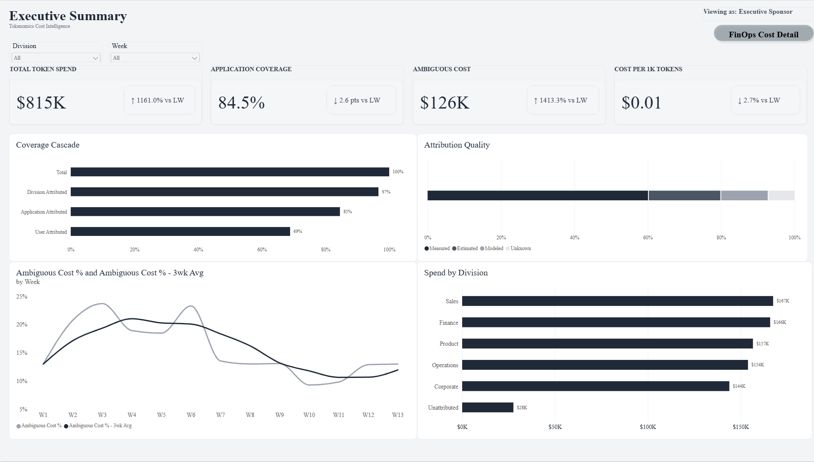
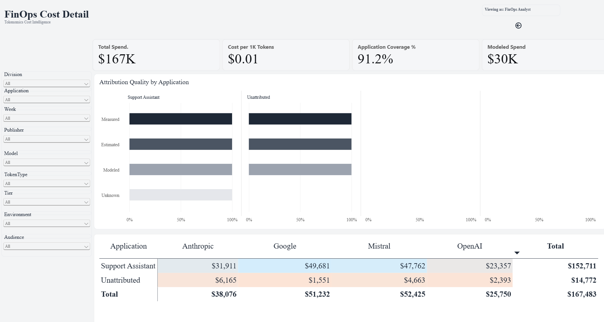

# LLM Token Spend Dashboard (Tokenomics Cost Intelligence)

A Power BI dashboard that helps a business track where its AI token spend goes, across LLM publishers, models, applications, divisions and users, and how much of that spend can actually be attributed.

## Questions it answers

- How much are we spending on LLM tokens, and how is it trending week over week?
- What share of spend can be tied to a division, an application and a user?
- How trustworthy is each dollar: measured, estimated, modeled or unknown?
- Which token types, models and tiers drive unit cost?
- Where is "ambiguous" spend concentrated, and is it improving?

## Report pages

**Executive Summary** (for executive sponsors)
- KPI cards: Total Token Spend, Application Coverage, Ambiguous Cost, Cost per 1K Tokens, each with week-over-week change
- Coverage Cascade: Total to Division to Application to User attribution
- Attribution Quality mix
- Ambiguous Cost % trend with a rolling 3-week average
- Spend by Division

**FinOps Cost Detail** (for FinOps analysts, drillthrough by division)
- Slicers for division, week, application, publisher, model, token type, tier, environment and audience
- Attribution quality by application
- Spend matrix by application and publisher

## How it helps the business

- **Showback and chargeback:** allocate AI costs to the teams and applications that drive them
- **Close attribution gaps:** see exactly where tagging breaks down
- **Control unit cost:** compare cost per 1K tokens by token type, model and tier
- **Trust the numbers:** every dollar carries an attribution-quality label

## Data model

Star schema built around a single fact table.

| Component | Count |
|---|---|
| Fact table (FactTokenSpend) | 1 |
| Dimension tables | 11 |
| DAX measures | 35 |
| Relationships | 11 |
| Field parameters (Metric Selector, Group By Selector) | 2 |

Dimensions: Date, Division, Application, Publisher, Model, Token Type, Tier, Environment, Audience, Attribution Quality, User.

## Data

The report ships with a **sample dataset** (13 weeks, 312 rows) embedded in the model. It is illustrative only and does not represent any real organization.

In production, the fact table would be fed from provider usage and cost APIs (for example the Anthropic Usage & Cost Admin API and the OpenAI Usage and Costs API), combined with an application and user tagging standard to drive attribution.

## How to open

1. Clone or download this repository.
2. Open `tokenanalysis.pbip` in Power BI Desktop (a recent version with PBIP support).
3. Click **Refresh** to load the sample data.

## Author

Hari Muppa | [harimuppagith.github.io](https://harimuppagith.github.io)
